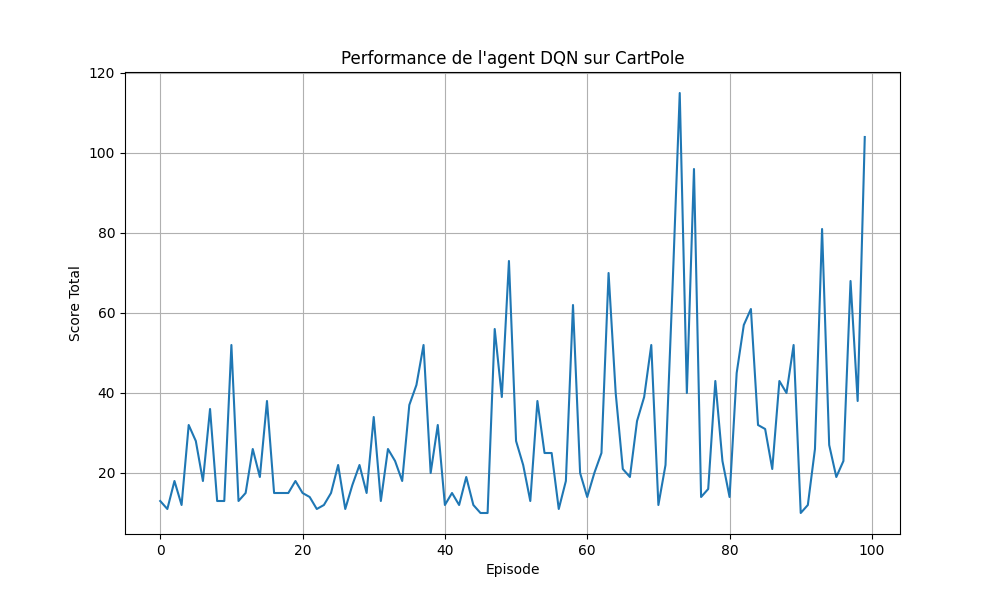

## Training Results

The DQN agent was trained on the CartPole-v1 environment for 100 episodes.

### Final Statistics

- Episodes: 100
- Final average score: 40.80
- Best score: 115.0
- Global average score: 29.76
- Final epsilon: 0.618

### Training Progress

The reward improved progressively during training.

Some results during training:

- Episode 10 → Score: 13.0
- Episode 20 → Score: 18.0
- Episode 40 → Score: 32.0
- Episode 50 → Score: 73.0
- Episode 90 → Score: 52.0
- Episode 100 → Score: 104.0

This shows that the agent gradually learned how to balance the pole and improved its performance over time.

---

## Training Curve

The graph below shows the evolution of the score during training:



---

## Hyperparameters

- Learning rate: 0.001
- Gamma (discount factor): 0.95
- Epsilon start: 1.0
- Epsilon final: 0.618
- Batch size: 32

---

## DQN Explanation

Deep Q-Network (DQN) is a reinforcement learning algorithm.

The agent interacts with the CartPole environment and chooses one of two actions:
- move left
- move right

A neural network predicts Q-values for each action.

Using replay memory and epsilon-greedy exploration, the model improves progressively and learns how to keep the pole balanced.

---

## Project Structure

dqn-cartpole-project/
│
├── dqn_cartpole.py
├── README.md
├── requirements.txt
└── results/
    ├── dqn_cartpole_model.h5
    └── training_progress.png


## Saved Model

The trained model is saved in:

results/dqn_cartpole_model.h5

This file stores the learned neural network weights in HDF5 format and can be reloaded for evaluation or further training.

##  Résultats

Le modèle DQN apprend progressivement à équilibrer le CartPole.


##  Modèle entraîné

Le modèle final est sauvegardé dans :

```bash
results/dqn_cartpole_model.h5
```

##  Lancer le projet

Pour entraîner le modèle :

```bash
python dqn_cartpole.py
```

